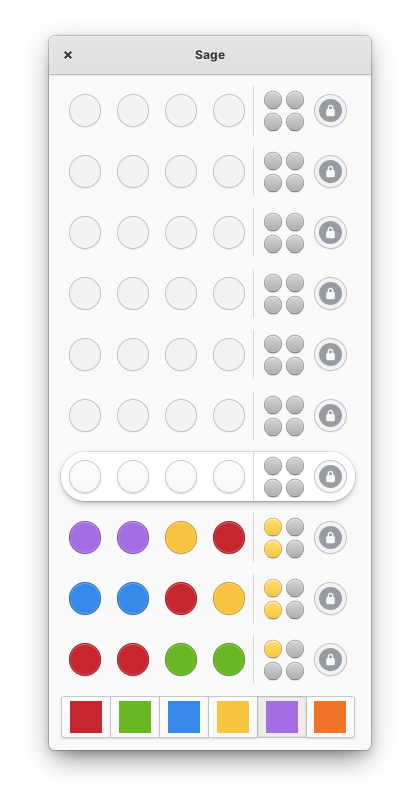
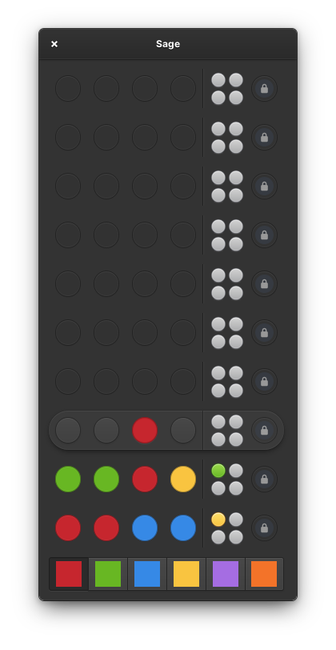

<h1>Sage</h1>

A code breaking game made for [elementary OS](https://elementary.io/).

[](https://appcenter.elementary.io/hr.from.josipantolis.sage)

|||
|---------------------------------------------------------|---------------------------------------------------|
| Default style screenshot                                | Dark style screenshot                             |


## Building and Installation

### Meson build

You can meet all dependencies by installing elementary SDK:

```sh
sudo apt install elementary-sdk
```

For a full list of dependencies check out the [meson.build file](meson.build).

Run `meson build` to configure build environment. Change into the build directory and run `ninja` to build

```sh
meson build --prefix=/usr
cd build
ninja
```

To install, use `ninja install`, then execute with `hr.from.josipantolis.sage`

```sh
ninja install
hr.from.josipantolis.sage
```

### Flatpak build

You may need to install elementary flatpak runtime first. You can do that with:

```sh
flatpak install --user io.elementary.Sdk//6.1
```

To install Sage use `flatpak-builder`, from project root directory run:

```sh
flatpak-builder build hr.from.josipantolis.sage.yml --user --install --force-clean
```

then execute with:

```sh
flatpak run hr.from.josipantolis.sage
```

## Translations

To generate translation files execute

```sh
ninja hr.from.josipantolis.sage-pot
ninja hr.from.josipantolis.sage-update-po
```

## License

[GNU GPLv3](COPYING)

Copyright © 2021 Josip Antoliš, josip.antolis@protonmail.com.

