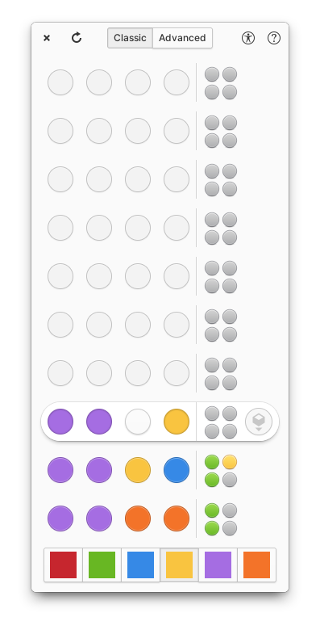
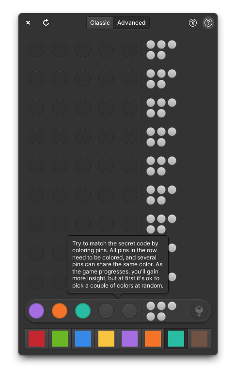

<h1>Sage</h1>

A code breaking game made for [elementary OS](https://elementary.io/).

[](https://appcenter.elementary.io/hr.from.josipantolis.sage/)
[](COPYING)
[](https://github.com/Antolius/Sage/actions)
[](https://github.com/Antolius/Sage/releases)

||          |
|---------------------------------------------------------|-----------------------------------------------------------------|
| Classic game in progress, showcasing the default style  | Advanced game with an active help tour showcasing the dark style |

## What's up with that name?

> **sage** `noun`: one (such as a profound philosopher) distinguished for wisdom
>
> [Merriam-Webster](https://www.merriam-webster.com/dictionary/sage)

I guess you need to be a sage in order to master this game. Or you'll turn into a sage by mere act of playing the game? Either way, you are the sage in the end.

## Kudos

- Inspiration for this game came form [@colinkiama's](https://github.com/colinkiama) [Challenge #2: Tabletop](https://www.reddit.com/r/vala/comments/r2j21y/challenge_2_tabletop/) over at [r/vala subreddit](https://www.reddit.com/r/vala). Kudos to Colin for energizing the Vala community over on Reddit, it makes app development in the ecosystem exciting!
- Next, I was heavily influenced by [@igordsm's](https://github.com/igordsm) recent [blog posts](https://dev.to/igordsm/vala-reactive-programming-2pf4) on reactive programming in Vala. Kudos to Igor for thinking through and eloquently elaborating on this design pattern!
- Lastly, elementary app development wouldn't be possible without the [elementary team](https://elementary.io/team). So kudos to [Danielle](https://github.com/danrabbit) and [Cassidy](https://github.com/cassidyjames) for running the show and the entire team for making elementary OS such a nice platform to develop for!

## How to install

Sage is packaged with [Flatpak](https://www.flatpak.org/) and published on elementary OS AppCenter. If you are running some other Linux distribution you can download the `flatpakref` file from [elementary repo](https://appcenter.elementary.io/hr.from.josipantolis.sage.flatpakref) and install it either using a graphical package manager, or from terminal with:

```sh
flatpak install --from ./hr.from.josipantolis.sage.flatpakref
```

## How to build from source

If you want to you can build Sage locally, from source. You can find detailed instructions for setting up local environment in [elementary developer docs](https://docs.elementary.io/develop/writing-apps/the-basic-setup).

### Build it with meson

You can meet all dependencies by installing elementary SDK:

```sh
sudo apt install elementary-sdk
```

For a full list of dependencies check out the [meson.build file](meson.build).

Run `meson build` to configure build environment. Change into the build directory and run `ninja` to build

```sh
meson build --prefix=/usr
cd build
ninja
```

To install, use `ninja install`, then execute with `hr.from.josipantolis.sage`

```sh
ninja install
hr.from.josipantolis.sage
```

### Build it with flatpak

You may need to install elementary flatpak runtime first. You can do that with:

```sh
flatpak install --user io.elementary.Sdk//6.1
```

To install Sage use `flatpak-builder`, from project root directory run:

```sh
flatpak-builder build hr.from.josipantolis.sage.yml --user --install --force-clean
```

then execute with:

```sh
flatpak run hr.from.josipantolis.sage
```

### Translate it?!

To generate translation files execute

```sh
ninja hr.from.josipantolis.sage-pot
ninja hr.from.josipantolis.sage-update-po
```

## License

[GNU GPLv3](COPYING)

Copyright © 2022 Josip Antoliš, josip.antolis@protonmail.com.
